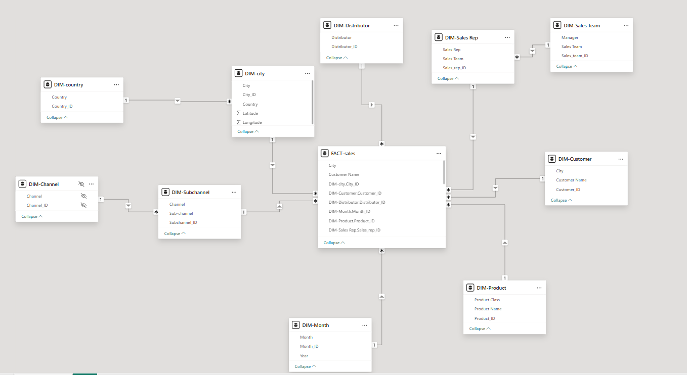
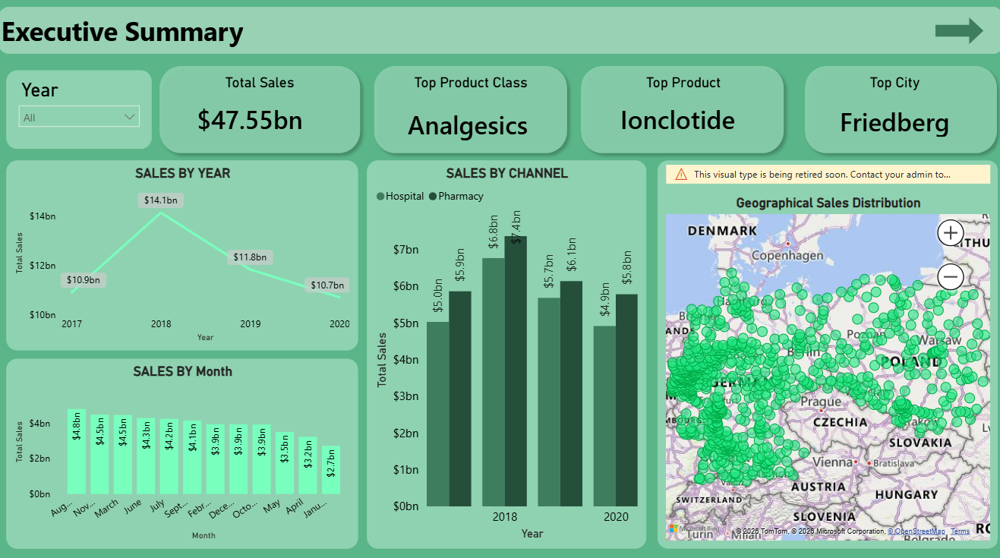
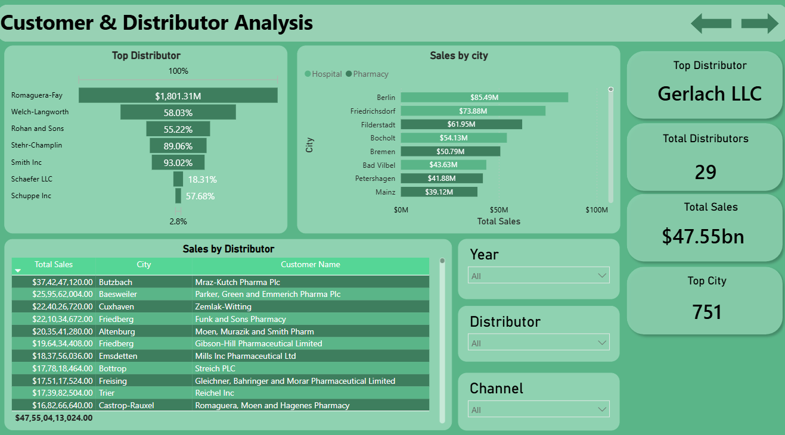
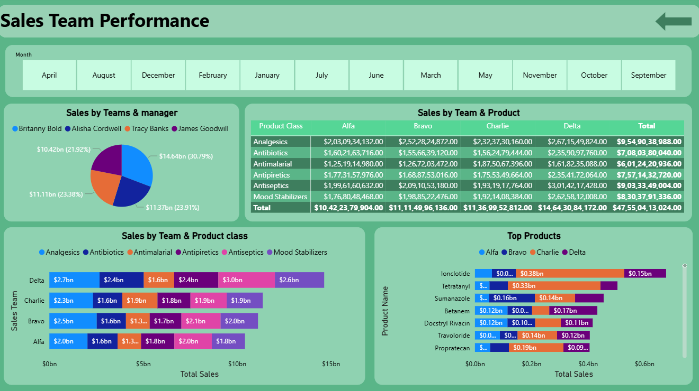

# 💊 Pharmaceutical Sales Analysis Dashboard

In a pharmaceutical company, sales do not happen directly with customers. Products are sold through distributors across different cities, channels, and sales teams. Because of this, it becomes difficult to understand where sales are coming from and who is contributing the most.

This project was created to solve that problem.

The goal was to take raw sales data and turn it into a simple and interactive dashboard that helps understand performance clearly. With this dashboard, anyone can quickly see which products are performing well, which cities generate more revenue, and how different teams and distributors are contributing.

## 🎯 What this dashboard helps to understand

* Total sales performance over time
* Which product and product class generates the most revenue
* Which city contributes the most to sales
* How distributors and customers are performing
* Which sales teams are doing better

## 🧩 Data model used

To make the dashboard fast and organized, a star schema data model was created.

* One main fact table contains all sales data
* Multiple dimension tables contain details like customer, product, city, distributor, and time

This structure helps in better performance and easy analysis.

## 📊 Dashboard pages

### 🔹 Executive Summary

This page gives a quick overview of the business.

It includes:

* Total sales
* Top product and product class
* Top city
* Sales trend by year and month
* Sales comparison by channel
* Map showing sales distribution

### 🔹 Customer and Distributor Analysis

This page focuses on understanding customers and distributors.

It includes:

* Top distributors
* Sales by city
* Customer-level data
* Filters to explore data easily

### 🔹 Sales Team Performance

This page shows how sales teams are performing.

It includes:

* Sales by manager and team
* Product performance by team
* Top products by sales

## 🛠 Tools used

* Power BI
* Power Query
* DAX
* CSV dataset

## 📈 What I learned

While building this project, I learned:

* How to create a proper data model
* How to write DAX measures
* How to design clean and simple dashboards
* How to turn data into meaningful insights

## 🚀 How to use

1. Download the pbix file
2. Open it in Power BI Desktop
3. Use filters and interact with visuals

## 📌 Conclusion

This project shows how raw data can be converted into a useful dashboard. It helps in understanding sales performance in a simple way and supports better decision making.

## 📬 Contact

Feel free to connect if you have any feedback or suggestions.

👩‍💻 Author

Shruti Upadhyay
